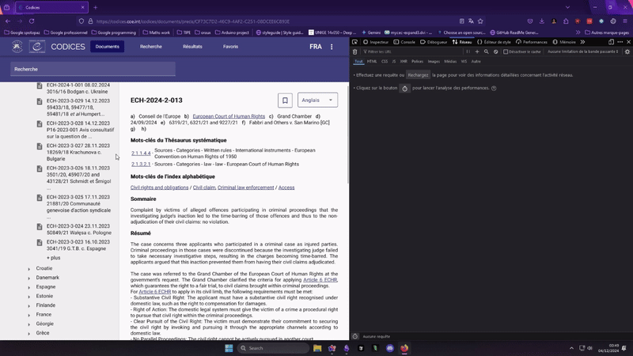
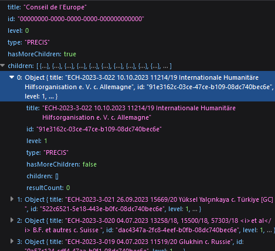
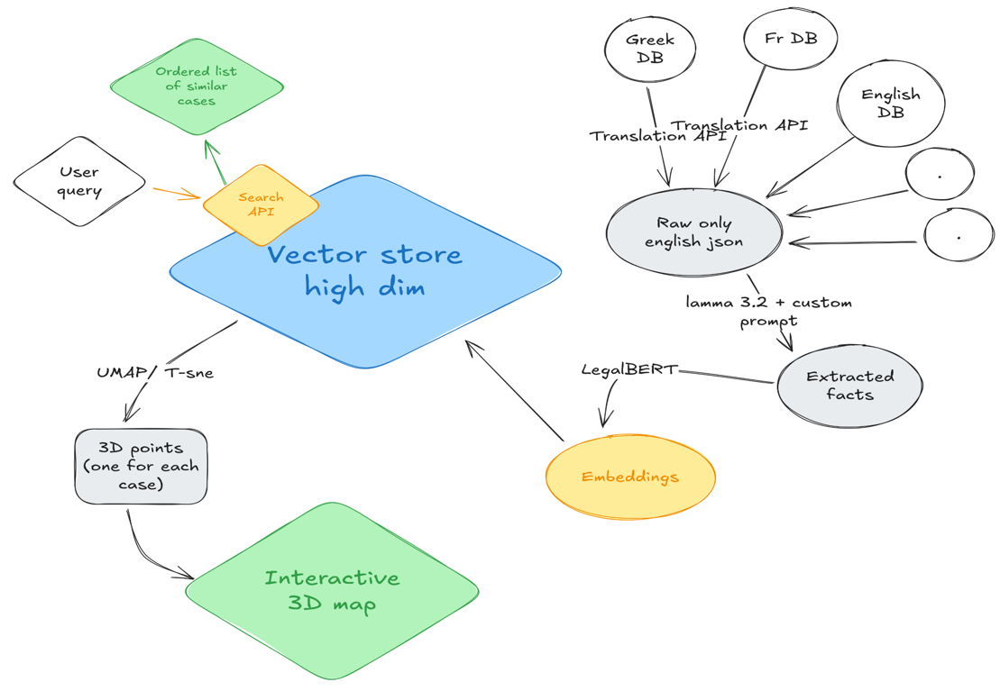

---
category:
  - "[[Journal de bord]]"
date: 2024-12-02
---

# Notre aventure au Hackathon Digital Justice

J'ai participé à mon premier hackathon d'envergure la semaine dernière. Organisé par le Conseil de l'Europe à Bologne, l'événement réunissait 7 équipes en compétition pour gagner 3 000 €.

Voici l'histoire de comment on a tenté de créer en 48 heures un outil qui aurait du prendre des mois de développement, comment on s'est retrouvé dans une impasse technique, et comment une solution de dernière minute nous a permis de décrocher la troisième place.

# Avant le Hackathon

## Comprendre le problème juridique

D'abord, un peu de contexte.
Le sujet du hackathon était de créer un outil permettant aux professionnels du droit (avocats, juges) de trouver rapidement des jugements pertinents pour leurs affaires en cours.

À ce stade, nous n'avions aucune idée de la complexité du domaine juridique. Par exemple, les lois de l'Union européenne sont appliquées différemment selon les pays, car elles sont interprétées à travers le prisme de chaque juridiction nationale.

Naïfs mais motivés, notre première étape était de comprendre à quoi ressemblaient ces fameux jugements.

On tombe sur un site qui répertorie pleins de compte rendus de jugements ainsi que des "précis" (des résumés de décisions) et qui semble plutôt moderne (https://codices.coe.int/codices/documents/welcome).

On se dit que pour faire des modèles d'IA on a besoin de beaucoup de ces textes, donc on décide de se lancer dans l'extraction des ces derniers.

## La collecte des données : techniques de scraping

J'ai utilisé une technique classique de scraping que tout développeur devrait connaître tant elle est utile.

Cette API était peu protégée, donc je te conseille de passer à la partie suivante si tu maîtrises déjà ces concepts. Je n'ai eu besoin d'aucune technique particulièrement originale pour récupérer les données (contrairement à quand j'ai reverse-engineered l'API SNCF pour [mon outil](https://track-my-train-times.vercel.app/) de suivi des prix).

L'approche consiste à reproduire dans un script les requêtes que le frontend envoie au backend, puis d'automatiser ce processus pour récupérer toutes les données souhaitées.

Pour cela on ouvre la console dev sur firefox (F12) et on regarde l'onglet network quand on clique sur "plus"



Une requête GET interressante apparait à cet URL :

`https://codices.coe.int/api/precis/tree?page=1&countryCode=ech&size=20&isFinalized=true`

Et les paramètres de la requête qu'on peut modifier :

`ECH` correspond à "European Court of Human rights"

`size` indique le nombre de résultats qu'on veut obtenir.

La réponse à cette requête contient une liste de 20 Titres + Id + autres infos sur les jugements qu'on veut récupérer. 🤑



On change `size=20` pour `size=10000` et on obtient une liste des 600 jsons qui contiennent `id` et `title`. 👍

On isole maintenant la requete qui permet de charger le texte d'un jugement à partir de son `id`.

On clique sur un article et on examine l'onglet requête.


Une requete GET vers `https://codices.coe.int/api/precis/DAF7533E-BA85-44F9-432E-08DCD0B6A0AC` qui renvoit un magnifique JSON strucuré.

Il nous reste à assembler un simple script python pour automatiser les requêtes pour récupérer le contenu à partir de chaque `id` et hop, une bdd avec pleins de jugements dans la poche 😎

Bon dans la vraie vie les données sont souvent un peu plus compliquées à scraper notamment parce qu'on ne peut pas souvent tout extraire en changeant `size=20` par `size=10000` pour tout récupérer d'un coup mais surtout parce que les données sont souvent protégées par de l'authentification. Il faut alors comprendre comment l'authentification est gérée.

En pratique, cela revient souvent à ajouter des headers à notre requête. Je ferai sûrement d'autres articles à ce sujet.

## Notre approche technique : embeddings et visualisation 3D

Récupérer les données de Codices ne nous a finalement pas tant aidés, car les juges (notamment Amaury Fouret, expert en data science à la Cour de cassation) nous avaient préparé un ensemble de 5 bases de données hétérogènes contenant des fichiers HTML, PDF, DOCX et JSON.

Notre corpus comprenait :

- 20 000 textes de jugements (entre 2 et 15 pages par texte)
- Plusieurs langues (anglais, français, grec, russe)
- Des juridictions différentes, impliquant des structures de contenu variées

Notre stratégie était de :

1. Créer des embeddings à partir de résumés en anglais générés par LLaMA 70B
2. Stocker ces vecteurs pour permettre des calculs de similarité rapides
3. Extraire 3 dimensions pertinentes de ces embeddings (d'environ 1000 dimensions)
4. Représenter les jugements sur une carte interactive en 3D



Cette architecture s'apparente à un système RAG (Retrieval-Augmented Generation), domaine très en vogue actuellement. Avec le recul, notre décision d'implémenter ces étapes manuellement n'était peut-être pas optimale - les gagnants ont utilisé une solution clé en main : [Weaviate](https://weaviate.io).

Je ne vais pas détailler ce qu'on a fait puisqu'on a pas pus aller au bout de cette solution, mais [Chroma db](https://github.com/chroma-core/chroma) semble etre un bon outil pour créer une vector database. On l'a fait tourner avec [LegalBert](https://huggingface.co/nlpaueb/legal-bert-base-uncased) en tant qu'embedder et on obtient des résultats très prometteurs sur notre base de fichiers test avec 600 fichiers.

On lui donne une phrase en input, il créé un embedding et cherche ceux qui sont les plus proches dans l'espace à 1000 dimensions.

```python
results = collection.query(query_texts=["Tax fraud committed by foreigners"], n_results=2,)
for i in range(len(results)):
    print(results[i].id, results[i].score)
    print(results[i].embedding)
    print(results[i].metadata)

    # On peut aussi récupérer les textes correspondants
    print(collection.get(results[i].id))
```

L'indexage a pris une vingtaine de minutes pour ces 600 fichiers,

par contre, lorsqu'on le fait tourner sur une bdd plus grosse de 20 000 ou même 5000 fichiers, impossible de terminer la création du vecteur store 😖.

Ce fut notre plus grosse déception de ce hackathon, avec ce vecteur store fonctionnel on aurait pu, j'en suis sûr scorer beaucoup plus au tests technique parce que oui, ce filou d'Amaury a voulu tester rigoureusement les performances de nos implémentations de RAG.

Et les tests qu'il avait préparés n'étaient pas de tout repos 🥵

# Le test technique

Le jury nous a transmis 60 résumés en anglais, chacun correspondant à un texte issu des bases de données mentionnées dans l'énoncé.

- Les résumé avaient 3 niveaux de détails (quelques phrases à 3 pages)

- Les résumés sont tous en anglais bien que les textes pouvaient être dans d'autres langues

Il nous fallait renvoyer pour chaque résumé une liste des 100 textes les plus similaires ids+scores de confiance renvoyés par notre outil. 😱

Une heure avant la deadline nous n'avons littéralement aucun moyen de passer une quelconque partie de ce test notre recherche de similarité grâce aux embeddings ayant échoué. Mais nous savions qu'échouer ce test nous disqualifie de la compétition, il fallait qu'on trouve une solution.

Et c'est là que les mots des mentors nous sont revenus : "vous savez, les embeddings c'est récent que ça fonctionne, vous devriez essayer des solutions plus anciennes, ça marche aussi très bien."

Et hop, ni une ni deux je vais chercher un TP qu'on a fait avec Gabriel Frey deux mois auparavant sur ElasticSearch à Telecom Strasbourg.

Un notebook complètement rempli qui décrit tout le processus d'implémentation d'Elastic Search pour une bdd de fichiers JSON.

Magnifique, grâce à cette solution qu'on parvient à faire fonctionner 5 min avant la deadline et avec quelques filouteries d'un membre de l'équipe : Ayoub on passe quelques tests avec des bons score de confiance.

On est sauvés, pas de disqualification !

# Frontend : map 3d + prompt

La partie vraiment originale de notre projet, c'est la visualisation de nos données sur une map 3D. Il nous fallait les choquer.

On voulait représenter des cas sur une map donc on a fait une map en 3D.
Le site est host sur Vercel et dispo [Ici](https://map-my-justice.vercel.app/)


L'implémentation de la visualisation est faite avec three JS (une bibliothèque pour faire de la 3d avec React, très puissante)

Les jurys ont été assez partagés sur cette visualisation car ce n'est pas le genre de chose auxquelles on est habitué quand on travaille dans ce domaine je les comprenais, j'aurais du encore plus insister sur la vision que j'avais pendant la présentation pour qu'ils comprennent que cette démo qu'on a fait en deux jours (et 10 prompts) était loin d'être la version finale que j'avais en tête.

J'avais pas mal d'idées pour améliorer cette visualisation sous forme de map pour la rendre plus stylée comme par exemple

- Zoomer directement sur le groupe de cas les plus similaires après le prompt
- Afficher les cas connectés avec des liens au survol
- Utiliser de effets de lumière pour mettre en valeur les zones denses

Je n'ai pas parlé de comment on passe des embeddings (750 dimensions environ) à une représentation 3D pour la Map. C'est parce qu'on a pas eu l'occasion d'explorer cet aspect plus que ça.
On avait quand meme une idée assez claire puisqu'on savait que des algorithmes comme UMAP et t-SNE pouvaient être utilisés pour faire de la représentation de données à haute dimension.

Les autres teams avaient des présentations vraiment impressionnantes pour la plupart et des gens habitués à parler en public (on était la seule team avec que des gens qui font de l'info). Cependant ont était les seuls à avoir proposé quelque chose de plus qu'un simple moteur de recherche amélioré. On avait la partie visualisation ce qui nous a redonné espoir.

Finalement ce qui a semblé avoir beaucoup compté c'est les performances aux tests techniques, car certaines équipes qui ont fait une magnifique présentation et dont l'outil semblait marcher extrêmement bien n'ont pas fini dans le classement. On a appris plus tard que leur performances étaient en fait très mauvaises et que leur démo était faite avec des fausses données (comme nous au final sauf qu'on a model qui marche au moins un peu).

Au final on repart avec une troisième place 🥉et l'estomac bien rempli de pâtes à la Bolognaise 🍝.

La ville de Bologne est vraiment magnifique

Faites des hackathons c'est sympa

## Ce que nous avons appris

Ce hackathon nous a appris plusieurs leçons importantes :

1. **Parfois, les solutions simples sont les meilleures** - Notre sauvetage de dernière minute avec ElasticSearch nous a rappelé que les technologies éprouvées peuvent être plus fiables que les approches de pointe dans un contexte de contrainte temporelle.

2. **L'innovation visuelle peut faire la différence** - Notre visualisation 3D nous a démarqués des autres équipes qui proposaient principalement des moteurs de recherche améliorés.

3. **Les performances techniques comptent** - Certaines équipes avec d'excellentes présentations n'ont pas été classées en raison de mauvaises performances aux tests techniques.

Au final, nous repartons avec une troisième place 🥉 et l'estomac bien rempli de pâtes à la Bolognaise 🍝.

Bologne est une ville magnifique, et je ne peux que vous encourager à participer à des hackathons.

Les hackathons c'est cool :)

Bisous


